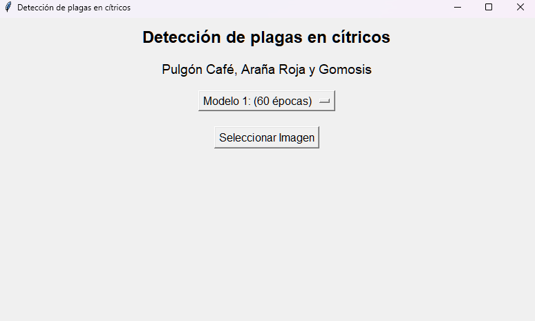
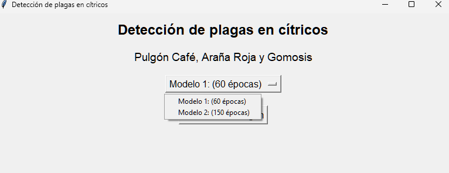
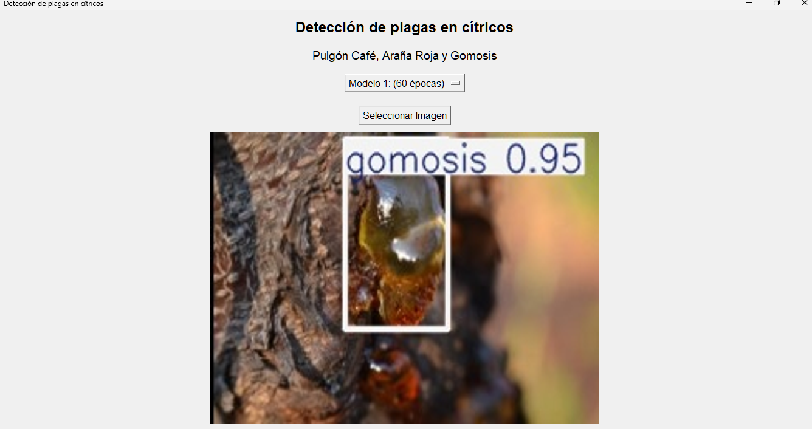
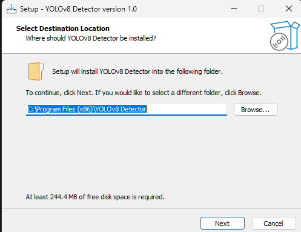
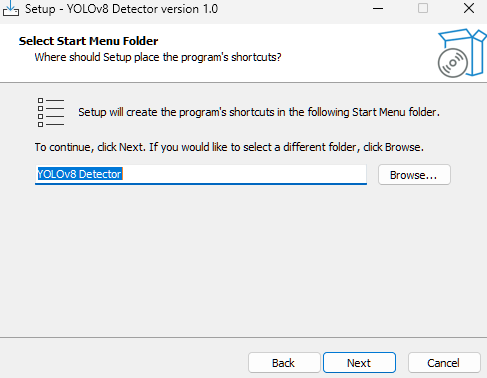
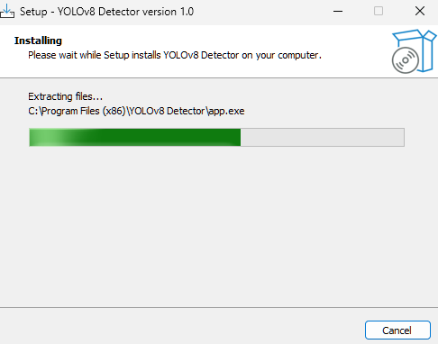

# RECONOCIMIENTO DE PLAGAS CON YOLOV8 EN PYTHON

Este programa está diseñado para detectar la presencia de plagas en arboles de cítricos, enfocándose específicamente en tres amenazas comunes: el pulgón café, la araña roja y la gomosis.


## Requisitos del sistema
- Python 3.13 
- Pycharm Community Edition (opcional)
- Windows 11 64 bits
- Visual C++ Redistributable para Visual Studio 2015–2022

## Toda la documentacion esta disponible en la carpeta documentacion en formato pdf

Links de descarga

Instalador
[Instalador del proyecto](https://drive.google.com/file/d/1zNTolNuoeiXYfqKkpCfz-nGngFu2gXPN/view?usp=drive_link)

Proyecto completo
[Carpeta comprimida del proyecto](https://drive.google.com/file/d/1zxSyWpFSUtMyB7VaPe4JG-YAFJRXLNWA/view?usp=drive_link)


# Instalacion en modo desarrollador
Abrir el entorno en pycharm.


## Ejecución
Una vez abierto debera ejecutar el entorno via consola en pycharm 
con el siguiente comando 
```bash
python app.py
```

Esto ejecutara el archivo principal que contiene toda la logica del proyecto.


## Ventana Principal
Nos mostra ventana principal es una interfaz grafica donde se puede seleccionar una imagen para analizarla con YOLOv8.
- Imagenes con Pulgon Café ✅
- Imagenes con Araña Roja ✅
- Imagenes con Gomosis ✅
- Imagenes sin Plagas ❌





## Uso
Damos clik en el boton "Modelo.." y seleccionamos el modelo que deseemos usar.
Cada modelo esta entrenado con una cantidad diferente de epocas.

Tambien debemos selecionar una imagen, despues de seleccionar la imagen el programa mostrara el resultado automaticamente. 




## Resultado
Ejemplo de un resultado obtenido por el programa.



# Instalacion en windows 

Para instalar el programa en windows solo debe descargar el instalador 
YOLOv8_Installer.exe

Se ejecutara el instalador y luego solo seguir los pasos indicados.

## Pasos de instalacion en windows

Al ejecutar el instalador nos preguntara en que ruta se va a instalar el programa, podemos dejar la ruta por defecto (recomendado)



Damos en siguiente en esta parte dejando el nombre por defecto



Finalmente damos en install y esperamos a que termine la instalación




## Modo de uso

Solo debemos buscar en la barra de busqueda el programa y darle doble click
El nombre es YOLOV8 Detector


# Modificar el proyecto 

Si desea modificar el sistema deberá tener conocimientos básicos de python y pip.

